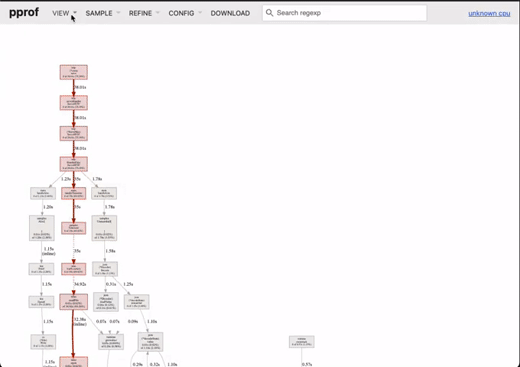

# Go Profiling Samples

Some samples implementations to illustrate how to use
[Go Profiling](https://go.dev/doc/diagnostics#profiling) to improve a Go code.

## Samples

This project has three implementations with issues performance common
in a Go code.

### JSON Unmarshalling sample

Simple implementation that will do a unmarshall multiple times as defined on param.

```http request
GET /json/unmarshall?times={times}
```

```go
func Unmarshall[T any](times int) (result T) {
	file, err := os.ReadFile(fmt.Sprintf("%stest.json", Path))
	if err != nil {
		panic(err)
	}

	for i := 0; i <= times; i++ {
		err = json.NewDecoder(bytes.NewReader(file)).Decode(&result)
		if err != nil {
			panic(err)
		}
	}

	return
}
```
[samples/json.go](samples/json.go)

### Load location with timezone sample

Simple implementation that will load a location with tz multiple times as defined on param.

```http request
GET /timezone?times={times}
```


```go
func Timezone(times int) (tz *time.Location) {
	for i := 0; i <= times; i++ {
		var err error
		tz, err = time.LoadLocation("America/Sao_Paulo")
		if err != nil {
			panic(err)
		}
	}

	return
}
```
[samples/timezone.go](samples/timezone.go)

### Allocations inside a loop sample

Simple implementation that will create an object and append on slice and iterate it
multiple times as defined on param.

```http request
GET /aloc?times={times}
```

```go
func Aloc[O any, T []O](obj O, times int) (result T) {

	for i := 0; i <= times; i++ {
		result = append(result, obj)
	}

	for _, o := range result {
		fmt.Printf("%+v\n", o)
	}

	return
}
```
[samples/aloc.go](samples/aloc.go)

## Using pprof

On this project we will use the [HTTP pkg](https://pkg.go.dev/net/http/pprof) to run the pprof.

### Starting the app

First we will start the app.

```shell
go run .
```

### Running the pprof

To generate the pprof data and render it on a web page
we have to execute passing the expected endpoint available with follow args:

```shell
go tool pprof -http=localhost: http://localhost:7777/debug/pprof/profile?seconds=60
```

### Simulating HTTP requests

Now for the pprof data has some metrics
we have to simulate some parallel requests immediately after run the pprof.

```shell
curl "http://localhost:7777/json/unmarshall?times=10000000" &
curl "http://localhost:7777/timezone?times=100000" &
curl "http://localhost:7777/aloc?times=1000000" &
```

### Expected web page

After 60 seconds we have to be redirected to a web page as below:



[https://youtu.be/hmD9zBjuc74 "Go tool pprof web interactive"](https://youtu.be/hmD9zBjuc74)

## Pull requests with improvements of the samples

 - [Improve JSON route decode #1](https://github.com/rafaelhl/profiling-samples/pull/1)
 - [Improve timezone load #2](https://github.com/rafaelhl/profiling-samples/pull/2)
 - [Improve aloc processing route #3](https://github.com/rafaelhl/profiling-samples/pull/3)
 - [Validate an error avoiding returning any result with err #5](https://github.com/rafaelhl/profiling-samples/pull/5)


